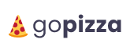

<p align="center">
  <a href="" rel="noopener">
 </a>
</p>

<h3 align="center">gopizza</h3>

<div align="center">

[]()
[](https://github.com/beatrizf13/gopizza/issues)
[](https://github.com/beatrizf13/gopizza/pulls)
[](/LICENSE)

</div>

---

## 📝 Table of Contents

- [About](#about)
- [Demo](#demo)
- [Getting Started](#getting_started)
- [Built Using](#built_using)
- [Authors](#authors)

## 🧐 About <a name = "about"></a>

Order custom pizza!

## 🎥 Demo <a name = "demo"></a>

<a rel="noopener" target="_blank" href="https://gopizza.netlify.app">Demo</a>

You also can see the prototype on <a  rel="noopener" target="_blank" href="https://www.figma.com/file/s0LiH4sN7tYPzgLjvZbvPT/gopizza">Figma</a>.

## 🏁 Getting Started <a name = "getting_started"></a>

These instructions will get you a copy of the project up and running on your local machine for development and testing purposes.

### Prerequisites

What things you need to install the software and how to install them.

```
node -v
```

### Installing

A step by step series of examples that tell you how to get a development env running.


```
yarn
```

```
yarn start
```

## ⛏️ Built Using <a name = "built_using"></a>

- [TypeScript](https://www.typescriptlang.org/) - Typed JavaScript
- [React](https://reactjs.org/) - Web Framework

## ✍️ Authors <a name = "authors"></a>

- [@beatrizf13](https://github.com/beatrizf13) -  Initial work
